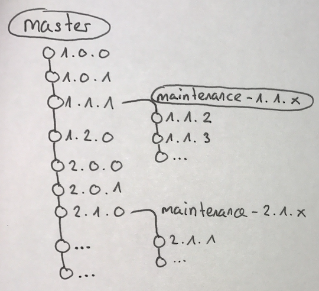

# How to Handle a Product Release

## Introduction

When you provide a package for multiple customers or a product (like we do with `livingdocs-server` and `livingdocs-editor`) you come to the point where you also have to support older versions. Everything (f.e. release-management / release-notes / github tagging / npm tagging) could be done manually, but this is not the way we want to work. Automation is king and we automated the release management to have reliable releases for customers.

## Scope

The scripts and description assumes that you already have setup a release-management pipeline with [Travis](https://travis-ci.com/), [Github](https://github.com/) and [Semantic-Release](https://github.com/semantic-release/semantic-release). The default semantic-release branch is `master`.

## Examples

## Example 1: Unplanned Maintenance

Let's say you are at version `2.1.0` of your package and a customer needs a bugfix in an old version `1.1.1`. The execution of `li-release create-maintenance-release --base-tag 1.1.1 --npm-auth-token <token>` creates a new branch `maintenance-1.1.x`. From now on you can just add patch commits to `maintenance-1.1.x`. `semantic-release` will handle the versioning automatically and counts up step by step `1.1.2`, `1.1.3` and so on. `master` just works like expected and counts up from `2.1.0` if you merge a pull request.

## Example 2: Planned Maintenance

When you have a release cycle (f.e. 1 month), you maybe have to provide a stable package for customers every month. You are at version `2.1.0` of your package at the end of the sprint and want to prepare a release branch with fixes for customers.

1. The versioning of `master` and the release branch shouldn't overlap. therefore, you have to bump the minor version of the master branch before creating the release branch. Execute `git commit --allow-empty -m "feat: bump minor version for release management"`, create and merge a PR to `master`. `semantic-release` will create version `2.2.0` and therefore the release-branch wont overlap for `2.1.x`
2. Execute `li-release create-maintenance-release --base-tag 2.1.0 --npm-auth-token <token>` - As in example one, this script creates a new branch `maintenance-2.1.x`, where you can make patches for `2.1.x` and you won't have a conflict with `2.2.0` and newer versions.
