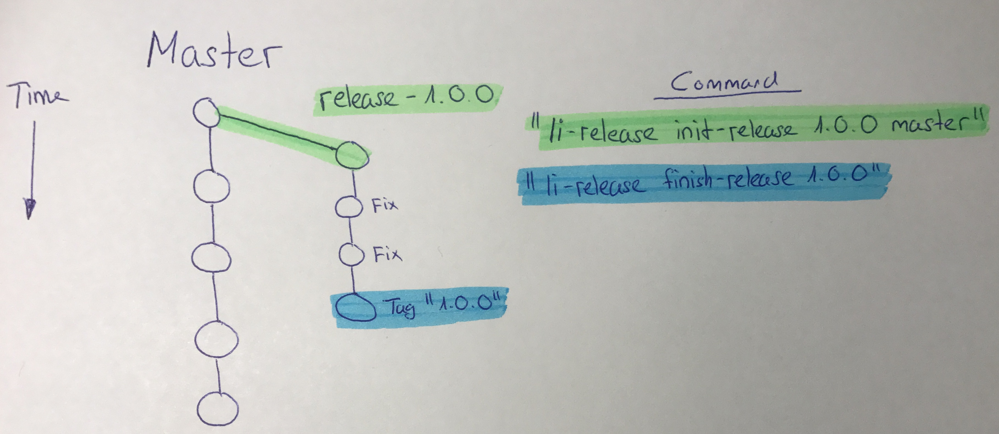
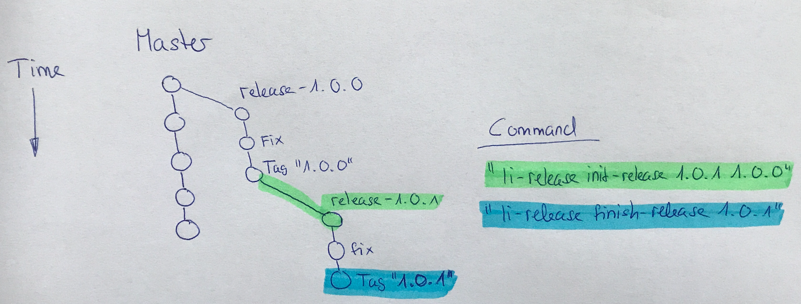

# How to Handle a Customer Release on Github

The release tools are aligned to the [cactus branch model](https://barro.github.io/2016/02/a-succesful-git-branching-model-considered-harmful/cactus-model.pdf) approach. This means you merge your pull requests to your integration branch (master). If you want to make a new release, you create a new release branch based on master (or a tag) and then make this branch ready for the deployment. From this time on master and the release branch are diverging. No merging from one to the other branch happens.

## Example 1: Standard Release

If you want to create a new release based on the master branch

1. `li-release init-release 1.0.0 master` creates a new release branch `release-1.0.0` based on the last master commit
2. make your fixes to the release branch `release-1.0.0` until it's ready for a deployment
3. `li-release finish-release 1.0.0` adds a tag `1.0.0` to the last commit in the branch `release-1.0.0`
4. Now you are ready for a deployment

## Example 2: Patch Release

After a release has been finished (f.e. `1.0.0`) and then you find errors in your `1.0.0` release and you need to make additional patches for a version `1.0.1`, you can create a new release branch based on version `1.0.0`.

1. `li-release init-release 1.0.1 1.0.0` creates a new release branch `release-1.0.1` based on the tag `1.0.0`
2. make your fixes to the release branch `release-1.0.1` until it's ready for a deployment
3. `li-release finish-release 1.0.1` adds a tag `1.0.1` to the last commit in the branch `release-1.0.1`
4. Now you are ready for a deployment
